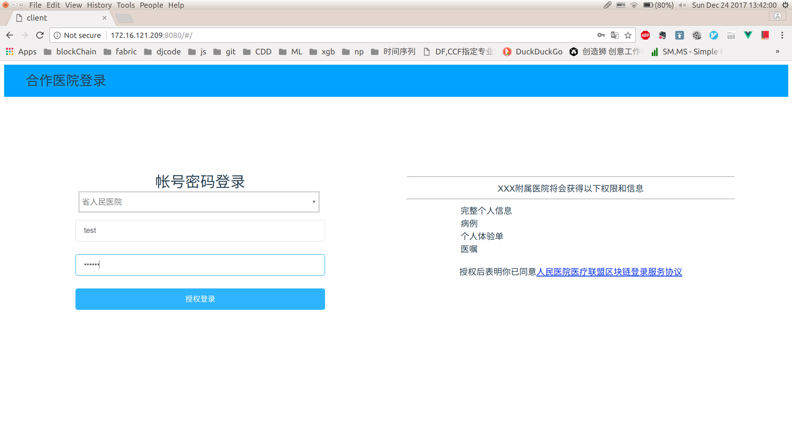
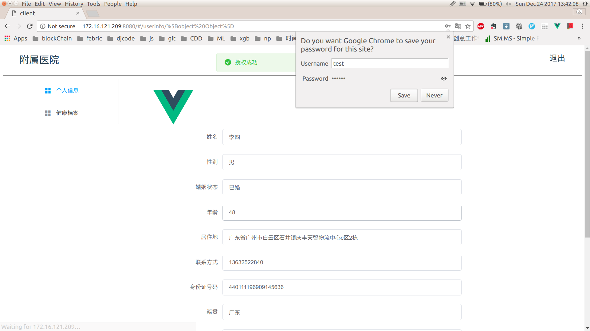
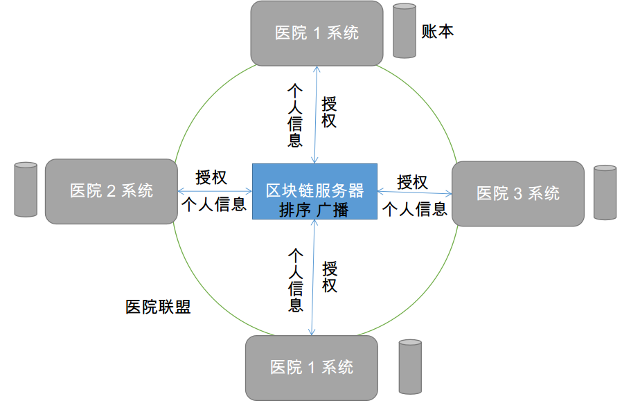

# 医院联盟系统客户端

> 模拟医院联盟系统用户登录,查看个人信息,修改个人信息

## 简介

本项目是 基于Hyperledger Fabric 技术的用户登录和数据共享项目--"依链通" 中的一个子项目,"依链通"是一个基于区块链技术的用户登录和数据共享平台,通过构建一个用户数据真实可信,及时更新的区块链用户登录系统,为企业间建立数据联盟提供服务基础.此外,基于合作企业登录及信息同步相关功能,"依链通"为跨行业的企业合作提供更多可能.本项目模拟了合作企业中的医院联盟.医院联盟中有多家医院,用户在其中一家医院系统中注册后,可使用该帐号密码在联盟中的其他未注册医院系统授权登录,共享数据.

## 安装

前端

``` bash
# install dependencies
npm install

# serve with hot reload at localhost:8080
npm run dev

# or

# build for production with minification
npm run build
```
后端

``` bash
# start server at 8889
node app.js
```

需要区块链服务器的REST api接口

## 功能

1. 登录



用户选择已注册的合作医院,输入该医院系统下的帐号密码,授权登录

2. 查看信息



用户成功登录后,跳转到个人信息页面,列出用户所共享的个人信息

3. 修改信息

用户点击对应个人信息的输入框,修改后点击空白处,完成修改信息

4. 同步信息

修改信息的键值对作为一次交易内容,被打包经过排序后写入区块链中并广播到各个节点,其他节点(联盟内合作医院)接收到广播后更新自己的数据

## 架构

